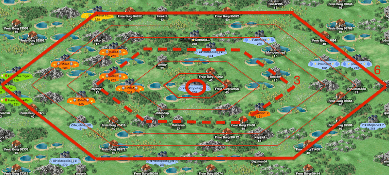

Title: Handbuch der Verteidigung
Author: Ez

# Handbuch der Verteidigung

***

Author: Ez

v2:
750ST+AS Faustregel.
Spionage zur Fake-Erkennung.
Brückentipp zu verschobenen Rundenzeiten.
Brückenformular.
Brückenbriefe.
Interne Verlinkung.
Inhaltsverzeichnis.

v1:
Erster Entwurf :D

***

## Inhalt

* [Einheiten][]
* [Gebäude][]
* [Entfernungen][]
* [Kampf][]
* [Nachtmodus][]
* [Warnposten][]
* [Erste Maßnahmen][]
* [Generelle Techniken][]
* [Brücken][]

## Einheiten [Einheiten]

### Einheitentypen
Es gibt 3 Einheitentypen, die vor allem zur Verteidigung genutzt werden (deff-Truppen): Armbrustschütze (AS), Speerträger (ST) und Panzerreiter (PR). Die drei offensiven Einheitentypen (off-Truppen), Bogenschütze (BS), Schwertkämpfer (SK) und Lanzenreiter (LR), können teilweise auch effektiv für Verteidigungstechniken benutzt werden, wie wir später beim [Brückenbau][Brücken] sehen werden. Das sollte aber, wenn möglich, die Ausnahme sein.

### Gattungen [Gattungen]
Die sechs Einheitentypen sind in drei Gattungen eingeteilt: Artillerie (AS, BS), Infanterie (ST, SK) und Kavallerie (PR, LR). Jeder Gattung ist also jeweils ein defensiver und ein offensiver Einheitentyp zugeordnet. Dabei ist es so, dass Artillerie am stärksten gegen Infanterie, Infanterie am stärksten gegen Kavallerie, und Kavallerie am stärksten gegen Artillerie ist.

### Panzerreiter und Aufteilung der Verteidigungseinheiten
*1 ST + 1 SK sind in allen Werten außer Geschwindigkeit und Rekrutierungszeit besser als (oder gleich wie) 1 PR*

Das heißt, dass Panzerreiter “nur" rekrutiert werden, weil sie die mobilsten Einheiten sind, und weil sie zum [Brücken][] bauen sehr praktisch sind.

Bei einer voll ausgebauten Burg für die man 2400 Untertanen für Verteidigungseinheiten reserviert, sind meiner Meinung nach 600 AS, 600 ST und 600 PR eine gute Wahl. Es ist wegen der Möglichkeit [Brücken][] zu bauen günstig, diese in Schritten von je 55 Einheiten zu rekrutieren.

### Bewegungsgeschwindigkeiten [Bewegungsgeschwindigkeiten]
Die Einheitentypen haben unterschiedliche Bewegungsgeschwindigkeiten. Eine Gruppe von Einheiten ist dabei immer so schnell, wie die langsamste Einheit. Wenn es auf die genauen Reisezeiten ankommt, ist es also wichtig, immer alle Einheiten eines Typs getrennt von anderen Einheitentypen loszuschicken. Also zum Beispiel erst alle PR zusammen, dann alle AS zusammen, dann alle ST zusammen. Man kann auch zum Beispiel PR auf die Geschwindigkeit von AS reduzieren, indem man einen einzelnen AS mitschickt.

Ohne „Umgebungskarte“ aus der Bibliothek:

* PR: 5 min/Feld
* LR: 6 ⅔ min/Feld
* BS: 8 ⅓ min/Feld
* AS: 10 min/Feld
* ST: 11 ⅔ min/Feld
* SK: 13 ⅓ min/Feld

## Gebäude [Gebäude]

### Wehranlage [Wehranlage]
Die Wehranlage erhöht die Verteidigung von Einheiten in der Burg um bis zu 100%! Weiterhin fügt die Wehranlage pro Kampfrunde einen festen Bonus zum Verteidigungswert gegen Artillerie, Infanterie und Kavallerie hinzu. Dieser feste Bonus ist mit maximal 1000 Punkten pro Gattung nicht sehr hoch (5-10 Verteidigungseinheiten?), und deshalb umso effektiver, je länger ein Kampf dauert, und je weniger Verteidigungseinheiten pro Kampfrunde ansonsten teilnehmen. Das kann bei langen [Brücken][] ein deutlicher Faktor werden. Die Wehranlage ist eines der wichtigsten Verteidigungsinstrumente, und Stufe 18 ist Pflicht für jede größere Burg!

### Zeughaus
Je höher die Stufe des Zeughauses, desto schneller werden Einheiten rekrutiert. Dein Ziel sollte es sein das Zeughaus mindestens auf Stufe 20 zu haben, und durchgehend Truppen zu rekrutieren. Gerade auch in der Nacht!

### Bibliothek [Bibliothek]
In der Bibliothek stehen die folgenden Verteidigungsrelevanten Forschungen zur Verfügung. Die Boni sind mäßig, aber die Kosten auch, insofern sollte man nicht vergessen, diese auch zu erforschen.
Auf Stufe 10 erlaubt die Bibliothek auch die Erforschung von "Umgebungskarte". Das ist die einzige Forschung die ich nicht uneingeschränkt empfehlen würde, da sie einige Nachteile mit sich bringt. Sie erhöht die Bewegungsgeschwindigkeit aller Einheiten um 5%. Die langsamsten Einheiten (Schwertkämpfer) brauchen damit für die maximal zurücklegbare Entfernung (288 Felder) statt 64 Stunden nur knapp 61 Stunden. Allerdings sind die [Bewegungsgeschwindigkeiten][] der Einheiten *ohne* "Umgebungskarte" auf die Dauer einer Kampfrunde abgestimmt. Mit erforschter "Umgebungskarte" sind dadurch viele Arten des [Brückenbaus][Brücken] deutlich schwieriger.

* Stufe 1
    * Langbogen: Erlaubt Bogenschütze
* Stufe 2
    * Steigbügel: Erlaubt Panzerreiter
* Stufe 3
    * Rüstungsschmied: 5% Verteidigung (Einheiten)
* Stufe 4
    * Schwertschmied: Erlaubt Schwertkämpfer
    * Eisenhärtung: 5% Verteidigung (Infanterie)
* Stufe 5
    * Armbrust: Erlaubt Armbrustschütze
* Stufe 6
    * Giftpfeile: 5% Verteidigung (Artillerie)
    * Pferdezucht: 5% Verteidigung (Kavallerie)
* Stufe 7
    * Pferdepanzerung: Erlaubt Lanzenreiter
* Stufe 10
    * Zisterne: 5% Verteidigung (Einheiten)

## Entfernungen [Entfernungen]
Mit etwas Übung kann man auf der Kartenansicht sehr leicht sehen, wie weit Burgen voneinander entfernt sind (wenn sie nicht zu weit voneinander weg sind). Das ist zum Beispiel wichtig beim [Brücken][] und beim Warnpostennetz. Ein Bild sagt mehr als tausend Worte (jede der Linien ist ein Feld weiter von der zentralen Burg entfernt):

## Kampf [Kampf]

### Kampfmechanik [Kampfmechanik]
Ein Kampf ist in Runden gegliedert. Der Ablauf dabei ist wie folgt:

1. Nach ankunft der ersten Einheiten des Angreifers beginnt eine 10-minütige Sammelphase. Alle Einheiten, die in dieser Zeit eintreffen, nehmen an der ersten Kampfrunde teil.
2. Die Kampfrunde wird durchgeführt: Die Truppenstärken werden verglichen und die Verluste auf beiden Seiten berechnet.
    1. Wenn beide Seiten diese Kampfrunde mit mindestens 100 Einheiten angetreten haben, verlieren beide Seiten nur die Hälfte der berechneten Verluste, und eine weitere 10-minütige Sammelphase beginnt. Alle Einheiten, die überlebt haben, und alle die in dieser Zeit eintreffen, nehmen an der nächsten Kampfrunde teil.
    2. Wenn eine oder beide Seiten die Kampfrunde mit weniger als 100 Einheiten angetreten haben, so verlieren beide Seiten die berechneten Verluste, und der Kampf ist beendet.
 3. Wenn der Angreifer den Kampf gewinnt, und er zum Ende des Kampfes mindestens die von ihm benötigte Menge Silber bei der angegriffenen Burg hat, wird die Burg von ihm erobert. Ansonsten kehren überlebene Einheiten des Angreifers mit geplünderten Ressourcen nach Hause zurück.

Die Verluste werden wie folgt berechnet: Die Angriffswerte der angreifenden Einheiten werden pro [Truppengattung][Gattungen] zusammen gezählt. Dazu kommen die Angriffsboni aus der [Bibliothek][] ihrer Heimatburg. Die Verteidigungswerte der verteidigenden Einheiten werden pro [Truppengattung][Gattungen] zusammen gezählt. dazu kommen die Verteidigungsboni aus der [Bibliothek][], der prozentuale und feste Bonus der [Wehranlage][], und eventuell der [Nachtbonus][] von 100%.

Dann werden diese Werte per [Gattung][Gattungen] verglichen. Das Verhältnis der Werte zueinander ist gleich dem prozentualen Verlust in dieser Truppengattung (maximal 100%). Beispiel: Wenn das Verhältnis zwischen Artilleriewert des Angreifers und des Verteidigers 3:2 ist, dann verliert der Angreifer 2/3 seiner Artillerieeinheiten, und der Verteidiger 3/2 (also alle). Eine Beispielrechnung ist in der L&K FAQ zu finden (z.B. Profil > FAQ auf iOS).

### Theoretische Einordnung
Die Berechnung der Verluste in jeder Kampfrunde ist linear in der Anzahl der gegnerischen Einheiten. Das heißt, dass die eigenen Verluste ausschließlich von der Anzahl (und Typen) der Einheiten des Gegners abhängen, und dass doppelte Anzahl der Einheiten des Gegners auch in doppelt so hohen Verlusten resultieren.

Das ist anders als in den meisten Strategie- und RTS-Spielen, die grob gesehen dem [quadratischen Gesetz von Lanchester](https://de.wikipedia.org/wiki/Gesetz_von_Lanchester) folgen. Bei diesem hängen die Verluste von der Differenz der quadrierten Anzahl der Einheiten beider Parteien ab. Bei dieser Art von Kampf ist es von großem Vorteil mit einer großen Übermacht anzugreifen oder zu verteidigen, denn je größer die eigene Übermacht ist, desto geringer sind die eigenen Verluste. Bei L&K gilt dies nicht. Eine größere Übermacht bringt keinen Vorteil bei den eigenen Verlusten. Deshalb gibt es keinen Nachteil, mit der geringstmöglichen Zahl an Einheiten zu verteidigen, was man sich beim [Brücken][] zunutze macht.

## Nachtmodus [Nachtmodus]
In der Nacht gibt es eine 8-stündige Phase, in der Verteidiger einen Bonus von 100% auf alle Verteidigungswerte bekommen. Die genaue Zeit hängt vom Server und der Zeitzone ab. Deutsche Server sind von 23-7 Uhr MEZ ("Winterzeit") im Nachtmodus (das ist während der Sommerzeit von 24-8 Uhr). Beim schicken von Einheiten wird neben der Ankunftszeit durch ein Sonnen- oder Mondsymbol angezeigt, ob die Einheiten am Tag oder im Nachtmodus am Ziel ankommen.

Wenn der Verteidiger es schafft einen Kampf durch [Brücken][] bis zum einsetzen des Nachtmodus zu ziehen, ist das ein großer Vorteil.

## Warnposten [Warnposten]
Niemand wird durchgehend online sein (die meisten Menschen müssen zumindest zwischendurch ein paar Stunden schlafen 😉), aber selbst im eigenen Bündnis bekommt man keine Angriffswarnungen für andere Spieler. Deshalb kann es sinnvoll sein, ein Warnpostennetz aufzusetzen. Dabei macht man sich zunutze, dass alle Verteidiger im Fall eines Angriffs eine Meldung bekommen. Die kommt zwar erst wenn der Angriff schon läuft, aber das kann besser sein als gar nichts.

Um ein effektives Warnpostennetz aufzubauen, schickt jeder 1 Handkarren + 4 Speerträger in alle benachbarten Burgen im Umkreis von 5-7 Feldern. Wenn ein Angriff erfolgt, bekommt jeder mit einem Warnposten in der Burg eine Meldung. Der Handkarren bleibt bis zum Ende des Kampfes erhalten, und stellt sicher, dass für jede Kampfrunde eine Meldung erfolgt. Die ST geben der Meldung mehr Gehalt:

1. Kein Verlust: [Fake][Fakes] (Scheinangriff oder missgeleiteter Farmtrupp)
2. 1 ST Verlust: 110er Angriff oder ein scharfer Angriff, die Burg hält
3. 2 ST Verlust: Scharfer Angriff, die Burg wird ohne Verstärkung fallen
4. 4 ST Verlust: Burg ist gefallen, und hatte weniger als 100 Verteidiger

Es ist nicht sinnvoll Warnposten weiter als maximal 10 Felder entfernt zu plazieren, denn die Angriffsmeldung kommt erst nach der ersten Kampfrunde, und eine voll besetzte Burg mit etwa 3000 Einheiten fällt nach 6 Runden. Panzerreiter, die schnellste Einheit, brauchen aber schon 50 Minuten (= 5 Runden) um 10 Felder zurückzulegen.

## Erste Maßnahmen im Fall eines Angriffs [Erste Maßnahmen]

### Ruhe bewahren!
Wenn eine Burg blinkt, kann dies das erste Mal ein wenig erschreckend sein. Wichtig im Falle eines Angriffs ist es aber vor allem Ruhe zu bewahren. Aktionismus und „HILFE ICH WERDE ANGEGRIFFEN“ im Forum zu schreiben bringt niemandem etwas. Erstmal die Lage einschätzen, Möglichkeiten abwägen, und dann gezielt mit ausreichend Informationen Hilfe vom Bündnis erfragen.

### Lage einschätzen
Zuerst solltest du dir ein paar Gedanken darüber machen, in welcher Lage du dich eigentlich befindest. Je nach Rahmenbedingungen hast du dann verschiedene Möglichkeiten die Verteidigung zu organisieren.

#### Zeitpunkt des Angriffs
In der „Einheiten“ Übersicht der angegriffenen Burg kannst du gut sehen, wann die ersten feindlichen Einheiten eintreffen. Beginnt der Angriff in der [Nacht][Nachtmodus], dann haben die Verteidiger einen großen Bonus. Beginnt der Angriff gegen Abend, dann ist es vielleicht möglich den Angriff durch [Brücken][] bis in die Nacht zu strecken, um dann vom [Nachtbonus][Nachtmodus] zu profitieren.

#### Anzahl der Burgen aus denen angegriffen wird
Kannst du gut in den Angriffsmeldungen in den „Berichten“ sehen. Eine voll ausgebaute Burg voller Einheiten die von einer Burg angegriffen wird, ist nicht in Gefahr, denn aus einer Burg können nicht genug Angriffseinheiten kommen. 

Eine Faustregel ist: *Wenn die verteidigende Burg eine ausgebaute [Wehranlage][] hat, dann verteidigen 750 Speerträger + 750 Armbrustschützen erfolgreich gegen die Offensivtruppen einer Burg, 1500 ST + 1500 AS gegen zwei Burgen, und so weiter.*

#### Anzahl der Burgen die angegriffen werden
Wenn mehr als eine Burg angegriffen wird, steigt die Wahrscheinlichkeit, dass nicht alle Angriffe scharf (also mit genug Truppen und Silber zur Burgübernahme ausgestattet) sind, und einige Fake- (Schein-) Angriffe dabei sind. Dann ist es um so wichtiger eine Möglichkeit zu finden, erst dann defensive Truppen zu senden, wenn sich herausgestellt hat, welche Angriffe scharf sind, denn es wird schwieriger genug Truppen in alle angegriffenen Burgen zu verteilen. Dazu baut man am besten für die angegriffenen Burgen eine [Brücke][Brücken] für die ersten paar Stunden. Das spart Einheiten, und gibt später genug Zeit um die [Fakes][] auszusortieren und Verstärkung auf die scharf angegriffenen Burgen zu schaffen.

#### Kannst du zum Zeitpunkt des Angriffs online sein
Dies ist ein sehr wichtiger Aspekt, denn er bestimmt entscheidend darüber, welche Verteidigungsmaßnahmen ergriffen werden können. Verteidigung ist am effektivsten, wenn der Verteidiger zumindest teilweise während des Angriffs online sein kann, um das Bündnis über die Details des Angriffs aufzuklären.

Wenn du während des Angriffes nicht online sein kannst, dann informiere auf jeden Fall dein Bündnis darüber! Dann können deine Mitspieler zumindest [Warnposten][] in deine Burgen stellen, um z.B. [Fakes][] auszusortieren.

### Angriffsmeldung an das Bündnis
Die Angriffsmeldung an das Bündnis sollte mindestens die folgenden Informationen enthalten:

* Angegriffene Burg (Name + Link)
* Angriffszeitpunkt (Datum + Uhrzeit)
* Angreifende(r) Spieler (Link)
* Anzahl der angreifenden Burgen
* Bist du während des Angriffs online?

Ohne diese Informationen ist es sehr schwierig für das Bündnis, dir zu helfen. Ohne den Link zum angreifenden Spieler können dir auch keine Verbündeten helfen, denn ohne diese Information können sie nicht überprüfen, ob sie dir wegen ihrer diplomatischen Beziehungen überhaupt helfen können.

Am besten ist es auch, gleich den Link zu einem [Brückenformular][] mitzuliefern.

## Generelle Techniken [Generelle Techniken]

### Fakes (=Scheinangriffe) aussortieren [Fakes]
Wenn mehrere Burgen angegriffen werden, ist das wichtigste überhaupt, die Fakes auszusortieren. Nur so ist es möglich die scharfen Angriffe effektiv abzuwehren. Eine übliche (weil effektive) Angriffstechnik ist es, auf viele Burgen 1 SK zu schicken, und nur auf eine oder wenige Burgen einen scharfen Angriff mit Silber zu machen (so dass alle möglichst gleichzeitig ankommen). Wenn du nicht in der Lage bist die Fakes zu erkennen, und dann die scharfen Angriffe entweder selbst zu verteidigen, oder solange bis Verstärkung vom Bündnis eintrifft, musst du entweder deine Verteidigung über viele Burgen verteilen, oder auf wenige Burgen konzentrieren von denen du nicht weißt, ob sie echten Angriffen ausgesetzt sein werden.

Fakes kann man meist erst beim Eintreffen der feindlichen Einheiten erkennen. Ab dann steht in der Einheitenübersicht der Burg genau, welche Einheiten angreifen. [Brücken][] kann dir helfen, die scharf angegriffenen Burgen solange zu halten, bis Verstärkung eintrifft. Wenn du zum Zeitpunkt des Angriffs nicht online sein kannst, können [Warnposten][] dem Bündnis helfen, Fakes auszusortieren, und dir gezielt zu helfen.

Nur selten kann man bei ungeübten Angreifern Fakes auch vor eintreffen der Truppen erkennen. In den Angriffsmeldungen in den "Berichten" siehst du die Zeiten, zu denen der Angreifer seine Einheiten von jeder Burg losgeschickt hat. Wenn die Zeitintervalle dort sehr kurz sind, zum Beispiel wenige < 5 Sekunden, oder sehr regelmäßig (z.B. exakt alle 20 Sekunden), dann steigt die Wahrscheinlichkeit, dass es sich um einen Fake handelt. Eine Garantie gibt es aber auch dann nicht.

Eine andere Technik um Fakes zu erkennen, ist es, einen Spion auf eine oder mehrere Burgen des Angreifers zu schicken. Wenn die Spione noch sehr viele Offensiveinheiten in den Burgen berichten, dann handelt es sich vermutlich bei allen Angriffen um einen Fake. Wenn nicht, dann ist wahrscheinlich mindestens ein Angriff scharf.

### Truppenstärke verschleiern
Es klingt absurd, doch wenn du zu Beginn des Angriffs online sein kannst, solltest du vorher alle deine Truppen bis auf 220 Verteidigungseinheiten aus der angegriffenen Burg in eine Nachbarburg abziehen, sofern du nicht sowieso [brückst][Brücken]. Sobald die erste Sammelphase beginnt, kannst du in der Einheitenübersicht der Burg sehen, wieviele und welche Truppen die Burg angreifen. Wenn sich der Angriff als [Fake][Fakes] herausstellt, schickst du besser deine Einheiten erst nach Ende des Kampfes zurück, denn dann sieht der Angreifer (sofern er mehr als 100 Einheiten geschickt hat) nur 220 Einheiten statt der vollen Verteidigungsstärke in seinen Kampfberichten.
Wenn der Angriff ernst ist, schickst du deine Einheiten in den Kampf. Denk an die Bewegungsgeschwindigkeiten der Einheiten, und dass genug Einheiten bis zur zweiten Kampfrunde zurück sein müssen (das ist 20 Minuten nach Beginn der ersten Sammelphase).

### Off-Truppen sichern
Wenn du deine off-Truppen nicht zum [Brücken][] benutzt, und sie nicht anderweitig für die Verteidigung brauchst, solltest du sie vor dem Kampf auf eine benachbarte Burg schicken. Die brauchst du noch für den Gegenschlag!

## Brücken [Brücken]
Brücken ist *die* Verteidigungstechnik in L&K schlechthin. Es ist eine Technik zum Strecken von Angriffen. Das hat verschiedene Vorteile:

* mehr Zeit zum Eintreffen von Verstärkung
* dadurch hilfreich beim Aussortieren von [Fakes][]
* Strecken in den Nachtmodus bringt großen Verteidigungsbonus
* Wehranlage macht maximalen Schaden

Die wesentlichen Nachteile sind der Aufwand, dass man zu passenden Zeiten online sein muss (je nach angewendeter Technik), und dass man bei einem einzigen kleinen Fehler den man übersieht, oder nicht mehr schafft auszugleichen, die Burg im wesentlichen kampflos verlieren kann.

Beim Brücken nutzt man aus, dass ein [Kampf][Kampfmechanik] erst dann beendet ist, nachdem eine der Seiten mit weniger als 100 Einheiten in eine Kampfrunde geht. Die allgemeine Beschreibung ist ganz einfach:

1. Stelle sicher, dass mindestens 110 Einheiten in der angegriffenen Burg sind, wenn der Kampf beginnt.
2. Schicke so Einheiten in die Burg, dass vor Beginn jeder Kampfrunde 55 Einheiten in der Burg ankommen.

Beispiel: Angriffsmeldung für 11:37. Die ersten 10 Minuten ist Sammelzeit, die erste Kampfrunde fängt 11:47 an, danach alle 10 Minuten. Schicke je 55 Einheiten so dass sie z.B. 11:45, 11:55, 12:05, 12:15, und so weiter in der Burg eintreffen. Die Einheiten dürfen frühestens 11:38, 11:48, 11:58 etc eintreffen damit sie nicht noch an der vorherigen Runde teilnehmen, und sie müssen spätestens 11:46, 11:56, 12:06 etc eintreffen, damit sie noch an der richtigen Kampfrunde teilnehmen.

Im folgenden werde ich verschiedene Techniken beschreiben, wie man dies mit möglichst wenig Aufwand realisieren kann. Hier erst noch ein paar allgemeine Tipps:

1. Überprüfe in der Einheitenübersicht der Burg regelmäßig, dort wo man die ganzen Ankunftszeiten von Unterstützung etc sieht, ob deine Brücke klappt, oder ob irgendwo Lücken auftauchen.
2. Überprüfe die tatsächen Rundenzeiten relativ kurz vor Beginn des Angriffs. Wenn der Angreifer noch Einheiten geschickt hat, die kurz vor den anderen Einheiten eintreffen, verschieben sich alle Rundenzeiten, und die Brücke kann Lücken bekommen!
3. Schicke 55 oder 110 Panzerreiter (oder mehr) in eine direkt benachbarte Burg. Das ist deine Notfallreserve, falls dir kurzfristig Lücken auffallen, die gestopft werden müssen.

### Angriffszeit für Brücke sichern
Eine übliche Angriffstechnik ist es, kurzfristig noch ein paar Einheiten loszuschicken, die kurz vor dem Rest der Angreifer ankommen. Dadurch verschiebt sich der *gesamte* Angriff ein paar Minuten vor, was für eine vorher gebaute Brücke fatal sein kann. Denn dadurch kann es passieren dass Verteidigungseinheiten, die eigentlich vor einer Kampfrunde ankommen sollten, nun *nach* der Kampfrunde ankommen, und die Burg fällt.

Gegen diese Angriffstechnik kann man sich verteidigen, indem man sich von einem Mitspieler zu einem festgelegten Zeitpunkt vorher *angreifen* lässt.

Beispiel: Angriffsmeldung für 11:37. Der Verteidiger lässt sich von einem Mitspieler zu 11:27 mit 110 Einheiten *angreifen*, und baut eine Brücke für diese Angriffszeit. Falls der Angreifer kurzfristig Einheiten zu 11:34 schickt, was normalerweise den ganzen Angriff auf 11:34 vorziehen würde, dann startet der Angriff trotzdem um 11:27, und die Brücke ist sicher. Natürlich könnte es nun noch sein, dass der Angreifer 110 Einheiten zu 11:24 schickt ... deshalb kann es besser sein sich vom Mitspieler zu 11:17 mit 110 Einheiten, und zu 11:27 mit 55 weiteren Einheiten angreifen zu lassen...

### Brückenformular [Brückenformular]
Da Brücken bauen sehr aufwändig und unübersichtlich ist, macht es Sinn sich Tools zu bedienen. Das Brückenformular ist eine interaktive Webseite, auf der man markiert, welche Kampfrunden durch genügend Einheiten abgedeckt sind. Das ist auch unersetzlich, wenn man sich untereinander beim Brückenbau helfen will.

Es gibt einige Internetseiten die Brückenformulare zur Verfügung stellen, zum Beispiel hier: [http://www.lakkt.de/lakkt_v2/php/def/](http://www.lakkt.de/lakkt_v2/php/def/)

Dort trägt man die genaue Angriffszeit, das Datum, den Burgnamen, und den Burglink ein. Der Knopf "Liste erstellen" öffnet dann die persönliche Webseite für diese Brücke. Die Internetadresse kopiert man dann in die Angriffsmeldung.

Die resultierende Liste hat eine Zeile pro Kampfrunde. In jeder Zeile steht rot hinterlegt ein Zeitintervall von 8 Minuten. Wer nun 55 oder mehr Einheiten geschickt hat, tippt oder klickt das Zeitintervall in dem die Einheiten in der Burg *ankommen*, und markiert es so grau. Der Besitzer der zu verteidigenden Burg überprüft die Daten im Formular mit den tatsächlichen Ankunftszeiten die er in der Einheitenübersicht der Burg sieht, und tippt noch einmal das Zeitintervall, und markiert es so grün. Wenn eine Zeit falsch eingetragen wurde, kann man das Intervall noch einmal tippen, dann wird es wieder rot.

### Alleine Brücken

Es gibt einige Techniken mit der man mit den Einheiten aus der angegriffenen Burg selbst effektiv Brücken bauen kann. Die meisten erfordern, dass man während des Angriffes zu bestimmten Zeiten online sein kann.

#### 6 Felder Deff + Off Brücke (1 Stunde, wiederholbar)

Vorteile:

* Stundenweise erweiterbar, solange die deff- und off-Einheiten reichen
* Leicht frühzeitig abbrechbar (z.B. bei Fake)
* Selbstgemacht

Nachteile:

* Präzise stündlich online sein
* Mit erforschter Umgebungskarte (+5% Geschwindigkeit) müssen die Zeiten recht präzise eingehalten werden
* Benutzt genauso viele off-Einheiten wie deff-Einheiten
* Braucht vertrauenswürdige externe Burg

So wird’s gemacht:

1. Suche eine vertrauenswürdige externe Burg in 6 Feldern Abstand (vertrauenswürdig = die Truppen die du dort hinschickst dürfen nicht vom Besitzer zurück geschickt werden. Gut sind kleine inaktive. Bei Verbündeten aktiven solltest du beim Besitzer bescheid geben.)
2. Schicke bis auf 110 Einheiten alle Einheiten in die Burg aus 1. (Diese müssen spätestens 100 Minuten vor Eintreffen der gegnerischen Einheiten dorthin losgeschickt werden.)
3. Schicke 13 Minuten (Toleranz +-2) vor Eintreffen der gegnerischen Einheiten, Gruppen von jeweils 55 PR, 55 LR, 55 AS, 55 BS, 55 ST, 55 SK getrennt voneinander zu deiner Burg zurück. Das baut eine Brücke für 1 Stunde nach der ersten Kampfrunde.
4. Wiederhole 3. jede Stunde.

Wichtig ist, dass die Einheitentypen in getrennten Gruppen von 55 Einheiten losgeschickt werden. Nur dann haben sie unterschiedliche Laufzeiten, und kommen mit etwa 10 Minuten Abstand zurück zur Burg (mit erforschter Umgebungskarte verkürzen sich die Abstände).

#### 3 Felder Deff Brücke (1/2 Stunde, wiederholbar)

Vorteile:

* Halbstündlich erweiterbar, solange die deff-Einheiten reichen
* Nutzt keine off-Einheiten
* Leicht frühzeitig abbrechbar (z.B. bei Fake)
* Selbstgemacht

Nachteile:

* Präzise halbstündlich online sein
* Sehr Fehlerintolerant, braucht präzises Timing
* Braucht vertrauenswürdige externe Burg

So wird’s gemacht:

1. Suche eine vertrauenswürdige externe Burg in 3 Feldern Abstand (vertrauenswürdig = die Truppen die du dort hinschickst dürfen nicht vom Besitzer zurück geschickt werden. Gut sind kleine inaktive. Bei Verbündeten aktiven solltest du beim Besitzer bescheid geben.)
2. Schicke bis auf 110 Einheiten alle Einheiten in die Burg aus 1. (Diese müssen spätestens 45 Minuten vor Eintreffen der gegnerischen Einheiten dorthin losgeschickt werden.)
3. Schicke 3 Minuten vor Eintreffen der gegnerischen Einheiten 55 AS, 1 Minute später 55 PR, und 1 weitere Minute später 55 ST zu deiner Burg zurück.  (Ohne erforschte Umgebungskarte mit Toleranz +-1, und die Staffelung ist nicht nötig.) Das baut eine Brücke für 1/2 Stunde nach der ersten Kampfrunde.
4. Wiederhole 3. alle 1/2 Stunden.

Die PR brauchen 15 Minuten, die AS 30 Minuten, die ST 35 Minuten (mit erforschter Umgebungskarte 5% weniger). Die Zeiten müssen deshalb sehr exakt eingehalten werden. Man kann die AS auch ein wenig früher und die ST ein wenig später zurückschicken, aber dann muss man länger am Stück online sein, und darf beim Warten nicht einschlafen 😉.

#### 3 Felder Deff Brücke mit Off-Support (1/2 Stunde, wiederholbar)

Vorteile:

* Halbstündlich erweiterbar, solange die deff-Einheiten reichen
* Nutzt minimal off-Einheiten
* Leicht frühzeitig abbrechbar (z.B. bei Fake)
* Selbstgemacht

Nachteile:

* Präzise halbstündlich online sein
* Nutzt minimal off-Einheiten
* Das zusammenstellen der Einheitengruppen kann fehleranfällig sein
* Braucht vertrauenswürdige externe Burg

So wird’s gemacht:

1. Suche eine vertrauenswürdige externe Burg in 3 Feldern Abstand (vertrauenswürdig = die Truppen die du dort hinschickst dürfen nicht vom Besitzer zurück geschickt werden. Gut sind kleine inaktive. Bei Verbündeten aktiven solltest du beim Besitzer bescheid geben.)
2. Schicke bis auf 110 Einheiten alle Einheiten in die Burg aus 1. (Diese müssen spätestens 50 Minuten vor Eintreffen der gegnerischen Einheiten dorthin losgeschickt werden.)
3. Schicke 4 Minuten (Toleranz +-3) vor Eintreffen der gegnerischen Einheiten, Gruppen von jeweils 1 LR+55 PR, 55 AS, 1SK+55 ST zu deiner Burg zurück. Das baut eine Brücke für 1/2 Stunde nach der ersten Kampfrunde.
4. Wiederhole 3. alle 1/2 Stunden.

Wichtig ist, dass die Einheitentypen exakt in den angegebenen Gruppen losgeschickt werden. Nur dann haben sie die richtigen Laufzeiten. Die PR mit dem LR brauchen 20 Minuten, die AS 30 Minuten, die ST mit dem SK 40 Minuten (mit erforschter Umgebungskarte 5% weniger).

#### Deff + Off Marktbrücke (1 Stunde, einmalig)

Vorteile:

* Braucht keine Vorbereitungszeit
* Braucht keine externe Burg

Nachteile:

* Geht nur einmalig für eine einstündige Brücke
* Braucht Markt exakt auf Stufe 5 (aber wozu sollte man auch mehr haben 😁)
* Benutzt genauso viele off-Einheiten wie deff-Einheiten

So wird’s gemacht:

1. Habe den Markt auf Stufe 5. Nicht 4. Nicht 6. Genau 5!
2. Schicke 13 Minuten (Toleranz +-2) vor Eintreffen der gegnerischen Einheiten, Gruppen von jeweils 55 PR, 55 LR, 55 AS, 55 BS, 55 ST, 55 SK getrennt voneinander auf deinen Markt zum Rohstoffe tauschen. Das baut eine Brücke für 1 Stunde nach der ersten Kampfrunde.
3. Schicke bis auf 110 Einheiten alle restlichen Einheiten in eine Nachbarburg.

Der Markt hat auf Stufe 5 eine Entfernung von 6 Feldern, kann also einmalig für die oben beschriebene 6 Felder Brücke benutzt werden. Das kann nützlich sein, wenn man einen Angriff kurzfristig bemerkt, und keine Zeit hat die Einheiten erst wegzuschicken und dann zum Brücken wiederzuholen. Die gewonnene Stunde kann man nutzen um das weitere Brücken vorzubereiten.

#### Deff + Off Burgfriedbrücke (4 Stunden, einmalig)

Vorteile:

* Innerhalb 35 Minuten eine Brücke für 4 Stunden bauen
* Braucht keine externe Burg

Nachteile:

* Braucht 220 Einheiten jedes Typs, inklusive off-Einheiten
* Muss vollständig gebaut werden, kann nicht verkürzt oder abgebrochen werden
* Braucht Burgfried Stufe 10 und erforschte Umgebungskarte

So wird’s gemacht:

1. Habe Bergfried auf Stufe 10.
2. Habe Umgebungskarte in der Bibliothek der Burg erforscht.
3. Schicke 103 Minuten (Toleranz +-3) vor Eintreffen der gegnerischen Einheiten, Gruppen von jeweils 55 PR, 55 LR, 55 AS, 55 BS, 55 ST, 55 SK getrennt voneinander auf deinen Burgfried zum Kupfer oder Silber tauschen.
4. Wiederhole 3. 93 Minuten, 83 Minuten und 73 Minuten vor Eintreffen der gegnerischen Einheiten.

Der Burgfried hat auf Stufe 10 eine Entfernung von 25 Feldern. Wenn man einmal 55 von jedem Einheitentyp tauschen schickt, dann kommen sie im Abstand von 39,5 Minuten zurück. Wenn man das noch 3 weitere mal im Abstand von 10 Minuten wiederholt, dann ist die Brücke komplett. Wenn nicht, dann klaffen große Lücken in der Brücke 😀.

### Brückenbriefe

#### 6 Felder Deff + Off Brücke (1 Stunde, wiederholbar)
1. Einheiten auf 6 Felder entfernte Burg schicken (mindestens 110 in Burg belassen!)
2. 13 Minuten (Toleranz +-2) vor Eintreffen der gegnerischen Einheiten, Gruppen von jeweils 55 PR, 55 LR, 55 AS, 55 BS, 55 ST, 55 SK getrennt voneinander zur angegriffenen Burg zurück schicken.
3. Jede Stunde nach Bedarf wiederholen.

#### 3 Felder Deff Brücke (1/2 Stunde, wiederholbar)
1. Einheiten auf 3 Felder entfernte Burg schicken (mindestens 110 in Burg belassen!)
2. 3 Minuten vor Eintreffen der gegnerischen Einheiten 55 AS, 1 Minute später 55 PR, und 1 weitere Minute später 55 ST zur angegriffenen Burg zurück schicken.  (Ohne erforschte Umgebungskarte mit Toleranz +-1, und die Staffelung ist nicht nötig.)
3. Jede halbe Stunde nach Bedarf wiederholen.

#### 3 Felder Deff Brücke mit Off-Support (1/2 Stunde, wiederholbar)
1. Einheiten auf 3 Felder entfernte Burg schicken (mindestens 110 in Burg belassen!)
2. 4 Minuten (Toleranz +-3) vor Eintreffen der gegnerischen Einheiten, Gruppen von jeweils 1 LR+55 PR, 55 AS, 1SK+55 ST zur angegriffenen Burg zurück schicken.
3. Jede halbe Stunde nach Bedarf wiederholen.

#### Deff + Off Marktbrücke (1 Stunde, einmalig)
Vorraussetzung: Markt exakt auf Stufe 5 (aber wozu sollte man auch mehr haben 😁)

1. 13 Minuten (Toleranz +-2) vor Eintreffen der gegnerischen Einheiten, Gruppen von jeweils 55 PR, 55 LR, 55 AS, 55 BS, 55 ST, 55 SK getrennt voneinander auf deinen Markt zum Rohstoffe tauschen schicken.
2. Das war’s schon. Nicht wiederholbar.

#### Deff + Off Burgfriedbrücke (4 Stunden, einmalig)
Vorraussetzung: Burgfried Stufe 10 und erforschte Umgebungskarte

1. 103 Minuten (Toleranz +-3) vor Eintreffen der gegnerischen Einheiten, Gruppen von jeweils 55 PR, 55 LR, 55 AS, 55 BS, 55 ST, 55 SK getrennt voneinander auf deinen Burgfried zum Kupfer oder Silber tauschen schicken.
2. 93 Minuten, 83 Minuten und 73 Minuten vor Eintreffen der gegnerischen Einheiten wiederholen.
3. Erst jetzt ist die Brücke gebaut, vorher klaffen große Lücken!
